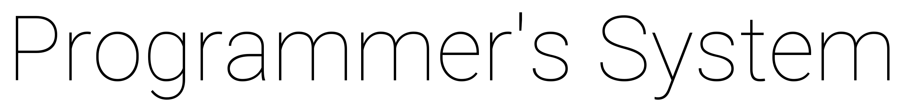

## About

Setting up a development machine is a time-consuming and error-prone process. Programmer's System eliminates these issues by providing a light weight, automated, configurable solution to install industry standard software ecosystems in Linux/Mac enviroments.

**Design**: The project prioritizes simplicity and stability, built on the foundation of "it's just scripts." Consult the development guide for all information. Essentially, Programmer's System facilitates the seamless installation of Linux/Mac distributions with initialization scripts for core packages and package configuration files (requirements.txt) are plugged in for each distribution. Once in place, isolated, industry standard scripts (and helper functions, supporting idependonce and shared script callers) are organized into "ecosystem" folders. See "ubuntu".

### TODO: swap the Peotry example to Usage

**Usage**: Leveraging the [setup guide](https://google.com), users can customize installations by commenting out specific packages. For instance, if a user prefers Pipenv over Poetry in the "Python" ecosystem, they can easily comment it out. Before installation, users specify their desired ecosystems (e.g., --python, --web_tools). This solution is designed for fresh setups, ensuring a hassle-free development environment.


## Ecosystems

|                       |                       |                       |                       |
|-----------------------|-----------------------|-----------------------|-----------------------|
| Python                | JavaScript and Node   | Web Tools             | Cloud                 |
| Containers and VMs    | Database Clients      | Version Control       | C and C++             |
| Java                  | Go                    | PHP                   | Rust                  |
| Ruby                  |                       |                       |                       |

<br/>

**Reference**: Utilizing the traditional *requirements.txt* configuration style, you can effortlessly define the packages to be included in your distribution's folder. Afterward, the command-line interface (CLI) is run used to do the rest:


```bash
./sys --cloud --web_tools --javascript_node --db_clients --python \
      --containers_vms --java --version_control
```

## Getting Started

- For *users*, follow the [setup guide](https://google.com) for a swift start.
- For *developers*, review the [comprehensive documentation](https://google.com).

## Running

Currently the stable Fedora 38 and Ubuntu 22.04 LTS are the supported distributions (OSX 14 is on the way). Kick off Programmer's System like so:

```bash
git clone https://github.com/programmers/system.git && cd system
./sys --init
./sys [ecosystems here]
```

[](https://asciinema.org/a/tXK8JwUmTW3k1NicCo0J2C3Kg)

## Contributing

#### HELP WANTED. THANKS.

• **General**: Add configuration framework (Bash/JSON) ([233](https://google.com)), limit use of Snap ([2823](www.a.com))
<br/>
• **Ecosystems**: New Mobile ([932](https://google.com)), Scientific ([992](https://google.com)), C# ([2182](https://google.com))
<br/>
• **Packages**: Rework Kubectl [843](https://google.com), add Terraform [482](https://google.com), add Java Gradle ([9834(www.a.com)]) & STS ([123](www.google.com)), add C & C++ Conan ([23](www.google.com)), add DB client pgadmin4 desktop ([823](www.as.com)]), Go cleanup ([223](www.googl.com))
<br/>
• **OS**: Implement [OSX 14](google.com) and top picks from distrowatch ([548](https://google.com))
<br/>
• **Sys Script**: Make sys a proper binary [9823](google.com), refactor install_ecosystem func ([2398](www.google.com)), clean up exec_script file name extract ([293](https://google.com)), refactor install_ecosystems ([293](www.google.com))
<br/>
• **Hardening**: Implement CI/CD nightly builds [488](https://google.com)


## License

[MIT](https://github.com/programmers/system_qa/blob/main/LICENSE)